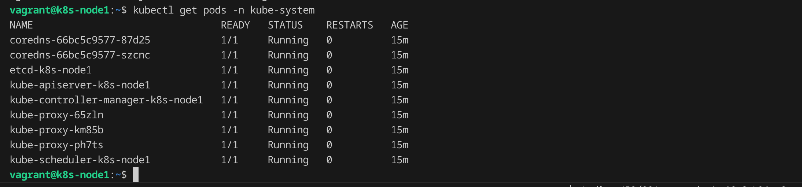
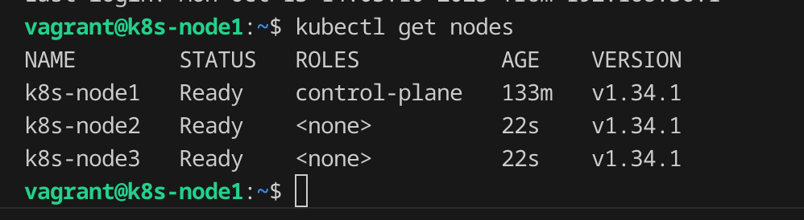
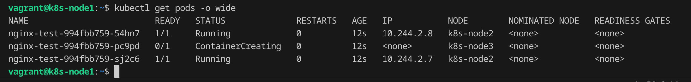

# Kubernetes Cluster with Ansible and Vagrant

A complete automation solution for setting up a multi-node Kubernetes cluster using Vagrant for VM provisioning and Ansible for configuration management.

## 🎯 Purpose

This project provides an automated way to:
- Deploy a 3-node Kubernetes cluster (1 master + 2 workers)
- Use Infrastructure as Code principles with Vagrant and Ansible
- Create a reproducible development/testing environment
- Learn Kubernetes cluster setup and management

## 🏗️ Architecture

The cluster consists of:
- **1 Master Node** (`k8s-node1`): 192.168.56.11
- **2 Worker Nodes** (`k8s-node2`, `k8s-node3`): 192.168.56.12, 192.168.56.13
- **CNI**: Flannel for pod networking
- **OS**: custom box based on ubuntu 22.04 server

## 📋 Prerequisites

Before running this project, ensure you have the following installed:

- **Vagrant** (2.2.0+)
- **VirtualBox** (6.0+)
- **Ansible** (2.9+)
- **Git**

### Installation Commands

#### Ubuntu/Debian:
```bash
# Install VirtualBox
sudo apt update
sudo apt install virtualbox

# Install Vagrant
curl -fsSL https://apt.releases.hashicorp.com/gpg | sudo apt-key add -
sudo apt-add-repository "deb [arch=amd64] https://apt.releases.hashicorp.com $(lsb_release -cs) main"
sudo apt update
sudo apt install vagrant

# Install Ansible
sudo apt install ansible
```

#### macOS:
```bash
# Install using Homebrew
brew install --cask virtualbox
brew install --cask vagrant
brew install ansible
```

#### Windows:
- Download and install [VirtualBox](https://www.virtualbox.org/wiki/Downloads)
- Download and install [Vagrant](https://www.vagrantup.com/downloads)
- Install Ansible using [Windows Subsystem for Linux (WSL)](https://docs.microsoft.com/en-us/windows/wsl/install)

## 🚀 Quick Start

1. **Clone the repository:**
   ```bash
   git clone https://github.com/sherifemad53/k8s-ansible-vagrant.git
   cd k8s-ansible-vagrant
   ```

2. **Start the cluster:**
   ```bash
   vagrant up
   ```

3. **Verify the cluster:**
   ```bash
   vagrant ssh k8s-node1
   kubectl get nodes
   kubectl get pods --all-namespaces
   ```

## 📖 Detailed Usage

### Starting the Cluster

The `vagrant up` command will:
1. Create 3 Ubuntu VMs with the specified configuration
2. Automatically provision them using Ansible
3. Set up the Kubernetes master node
4. Join worker nodes to the cluster
5. Install Flannel CNI for networking

### Accessing the Cluster

To access the master node:
```bash
vagrant ssh k8s-node1
```

Once connected, you can use `kubectl` commands:
```bash
# Check cluster status
kubectl get nodes
kubectl cluster-info

# View all pods
kubectl get pods --all-namespaces

# Deploy a sample application
kubectl create deployment nginx --image=nginx
kubectl expose deployment nginx --port=80 --type=NodePort
```

### Managing the Cluster

#### Stop the cluster:
```bash
vagrant halt
```

#### Restart the cluster:
```bash
vagrant up
```

#### Destroy the cluster:
```bash
vagrant destroy
```

#### Update cluster configuration:
```bash
# After modifying Ansible playbooks
vagrant provision
```

## 📦 Creating Custom Vagrant Boxes

For advanced users who want to create their own optimized Vagrant box, here's how to build a custom Ubuntu base box. The custom box provides a clean, optimized Ubuntu environment that Ansible will then use to install and configure Kubernetes.

### Manual Box Creation

1. **Create a base VM:**
   ```bash
   # Create new VM in VirtualBox
   VBoxManage createvm --name k8s-base --ostype Ubuntu_64 --register
   VBoxManage modifyvm k8s-base --memory 2048 --cpus 2
   VBoxManage createhd --filename ~/VirtualBox\ VMs/k8s-base/k8s-base.vdi --size 20480
   VBoxManage storagectl k8s-base --name "SATA Controller" --add sata --controller IntelAHCI
   VBoxManage storageattach k8s-base --storagectl "SATA Controller" --port 0 --device 0 --type hdd --medium ~/VirtualBox\ VMs/k8s-base/k8s-base.vdi
   VBoxManage storageattach k8s-base --storagectl "SATA Controller" --port 1 --device 0 --type dvddrive --medium ubuntu-22.04.3-live-server-amd64.iso
   ```

2. **Install Ubuntu and configure:**
   - Install Ubuntu 22.04 LTS
   - Create `vagrant` user with password `vagrant`
   - Install VirtualBox Guest Additions
   - Install basic dependencies (curl, gnupg, lsb-release)
   - Configure SSH access

3. **Package the box:**
   ```bash
   vagrant package --base k8s-base --output k8s-ubuntu-22.04.box
   vagrant box add k8s-ubuntu-22.04 k8s-ubuntu-22.04.box
   ```

### Benefits of Custom Boxes

- **Faster provisioning**: Pre-installed basic dependencies and Ansible reduce setup time
- **Consistent environment**: Same base configuration across all deployments
- **Reduced network usage**: Fewer package downloads during Ansible provisioning
- **Optimized base**: Clean, minimal Ubuntu with Kubernetes prerequisites ready
- **Custom optimizations**: Include your specific base configurations and tools

### What the Custom Box Includes

- **Base OS**: Ubuntu 22.04 LTS with latest updates
- **Basic dependencies**: curl, gnupg, lsb-release for package management
- **Ansible**: Pre-installed for faster provisioning
- **Swap disabled**: Kubernetes requirement handled at base level
- **Vagrant user**: Properly configured with SSH access
- **Guest additions**: VirtualBox integration for seamless operation

### Custom Box Tips

- Keep the box size minimal by removing unnecessary packages
- Don't install Kubernetes packages in the box - let Ansible handle that
- Document any custom base configurations in your box
- Version your boxes for reproducibility (e.g., `k8s-ubuntu-22.04-v1.0.box`)
- Test your custom box thoroughly before using in production
- The box should be a clean, optimized base that Ansible can build upon

## 🔧 Configuration

### VM Configuration (Vagrantfile)
- **Memory**: 2GB per node
- **CPUs**: 2 per node
- **Network**: Private network (192.168.56.0/24)
- **Box**: custom box

### Ansible Configuration

The project uses a role-based structure:

#### Common Role (`ansible/roles/common/`)
- Installs Kubernetes packages (kubelet, kubeadm, kubectl)
- Configures prerequisites (disables swap, adds Kubernetes repository)
- Sets up common dependencies

#### Master Role (`ansible/roles/master/`)
- Initializes the Kubernetes cluster
- Configures kubeconfig for the vagrant user
- Installs Flannel CNI
- Generates join command for worker nodes

#### Worker Role (`ansible/roles/worker/`)
- Joins worker nodes to the cluster using the join command

### Network Configuration

- **Pod Network CIDR**: 10.244.0.0/16 (Flannel default)
- **API Server**: Advertised on 192.168.56.11
- **Node IPs**: 192.168.56.11-13

## 🐛 Troubleshooting

### Common Issues

#### 1. VM fails to start
```bash
# Check VirtualBox is running
sudo systemctl status vboxdrv

# Restart VirtualBox service
sudo systemctl restart vboxdrv
```

#### 2. Ansible connection fails
```bash
# Verify SSH key permissions
chmod 600 ~/.vagrant.d/insecure_private_key

# Test SSH connection
vagrant ssh k8s-node1
```

#### 3. Kubernetes pods stuck in Pending
```bash
# Check node status
kubectl describe nodes

# Verify CNI is installed
kubectl get pods -n kube-flannel

# Check kubelet logs
journalctl -u kubelet -f
```

#### 4. Worker nodes not joining
```bash
# Regenerate join command
vagrant ssh k8s-node1
sudo kubeadm token create --print-join-command

# Copy and run on worker nodes
```

### Logs and Debugging

#### View Ansible logs:
```bash
vagrant up --debug
```

#### Check Kubernetes logs:
```bash
# Master node logs
journalctl -u kubelet -f

# Container runtime logs
sudo journalctl -u crio -f
```

## 📸 Screenshots

### Cluster Overview

*Kubernetes cluster with all nodes in Ready state*

### Node Details

*Detailed view of cluster nodes showing roles and status*

### Pod Distribution

*Pods running across different nodes in the cluster*


## 🤝 Contributing

1. Fork the repository
2. Create a feature branch (`git checkout -b feature/amazing-feature`)
3. Commit your changes (`git commit -m 'Add some amazing feature'`)
4. Push to the branch (`git push origin feature/amazing-feature`)
5. Open a Pull Request

## 📝 License

This project is licensed under the MIT License - see the [LICENSE](LICENSE) file for details.

## 🙏 Acknowledgments

- [Kubernetes Documentation](https://kubernetes.io/docs/)
- [Vagrant Documentation](https://www.vagrantup.com/docs)
- [Ansible Documentation](https://docs.ansible.com/)
- [Flannel CNI](https://github.com/flannel-io/flannel)
